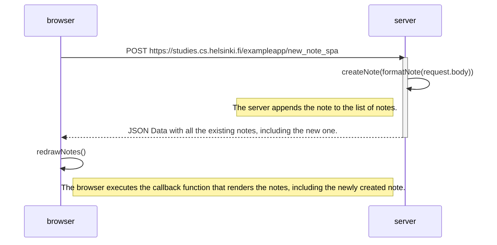

```mermaid
sequenceDiagram
    participant browser
    participant server

    browser->>server: POST https://studies.cs.helsinki.fi/exampleapp/new_note_spa
    activate server
    server->>server: createNote(formatNote(request.body))
    Note left of server: The server appends the note to the list of notes.
    server-->>browser: JSON Data with all the existing notes, including the new one.
    deactivate server

    browser->>browser: redrawNotes()
    Note right of browser: The browser executes the callback function that renders the notes, including the newly created note.
```